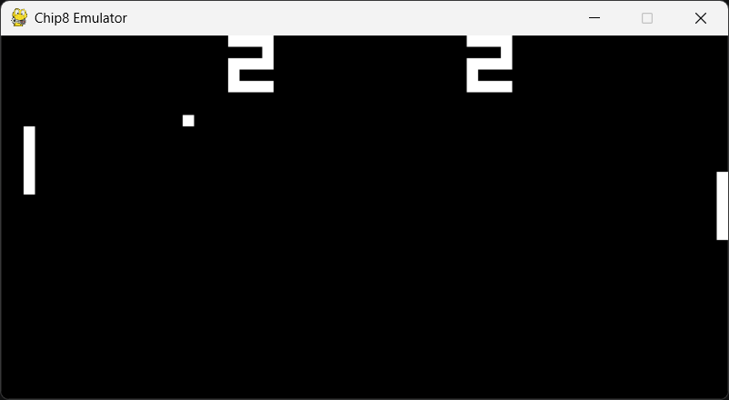
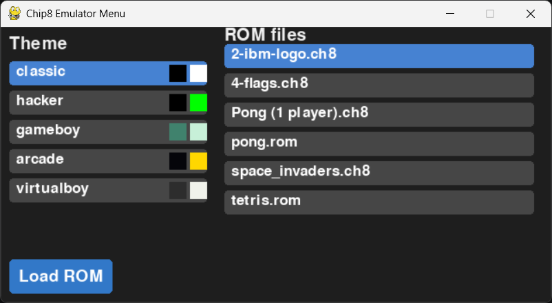

# chip8-python
 

A Chip8 emulator written in Python as a brief side project.

 

## Quick Start
- Install `pip install -r requirements.txt`
- Put your ROM in a folder `roms` and/or update the path in main.py if you want to store somewhere else
- Run `python src/main.py`

Alternatively, download the latest version from the releases, extract and run the .exe file

## Features
- Theme selector and rom selector gui, the emulator can run most games, however some older games that assume slightly different CPU behaviour may not work as expected. 

## Future Plans

- [X] Rewrite cpu dispatch to use nested match rather than if/elif/else for performance
- [X] GUI to select games
- [ ] CHIP 48 Support
- [ ] SUPER-CHIP Support
- [X] Configurable colour themes
- [ ] Rust rewrite (likely in a companion repo)

## References and Credits

Thank you to: 
- Cowgod for his technical reference
- Timendus and corax89 for their test roms. 
- David Winter for his pong rom and kripod for his ROM collection. 

## License

MIT (see LICENSE)

